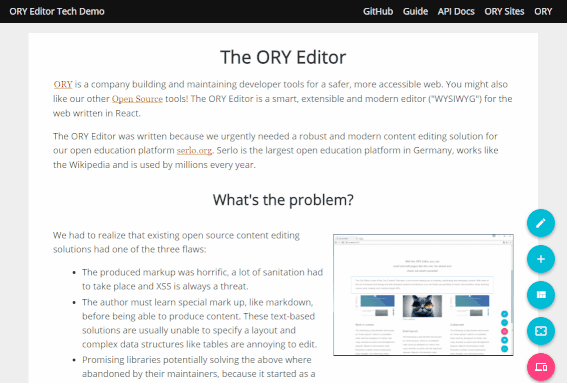

译： Evilrule

ORY Editor 是一个基于 React 技术的简洁，可扩展现代 Web 编辑器。如果你已经受够了受限的内容编辑器，那你来对了地方。




Demo 检出地址 [ory-editor.aeneas.io](https://ory-editor.aeneas.io/)!

> **重要提示**: 这个编辑器是预发布版本，不保证向后兼容性。此项目由作者和核心维护人员   [Aeneas Rekkas](http://github.com/aeneasr/) 作为个人项目维护

- [简介](#introduction)

  - [存在的问题?](#whats-the-problem)
  - [不同的解决办法?](#so-whats-different)

- [快速入门](#quickstart)

- [文档](#documentation)

- [如何运行，开发和构建](#how-to-run-develop-and-contribute)

  - [安装依赖](#install-dependencies)
  - [运行范例](#run-the-examples)
  - [运行工具链](#run-the-toolchain)
  - [运行文档](#run-the-documentation)

- [推荐工具](#recommended-tools)

- ###### [已知 issues](#known-issues)

## <span id='Introduction'>简介</span>

我已经加入[维基百科学习]（https://de.serlo.org）将近十年了。经验和教训使我踏上了创建ORY编辑的旅途。我想让网络上的内容编辑变得容易，并通过  web 内容创建和编辑技术丰富开源社区。

### <span id='whats-the-problem'>存在的问题</span>

我意识到现有的开源内容编辑器解决方案通常有下面三个缺陷的一个或多个。

* 产生大量的标记，必须进行大量的清理工作，同时 XSS  的威胁总是存在。

* 在制作内容以前，作者需要学习特殊的标记语言，比如 markdown。这些基于文本的解决方案通常无法指定布局，像表这样复杂的数据结构编辑起来很麻烦。

* 无法使用布局（如 flexbox 或 grids）


### <span id='so-whats-different'>不同的解决办法</span>

我的结论是，解决方案必须符合以下原则：

* 状态使用规范的 json, 不牵涉 HTML。
* 它是一个不需要编程经验和特殊训练的虚拟编辑器。
* 基于可服用的 React 组件。 让开发，作者和设计人员以一种更好的方式在一起工作。
* 可以在移动手机和触摸设备上使用.

基于这些原则，我出实现 ORY 编辑器，你现在看到的就是它。

## <span id='quickstart'>快速入门</span>

目前的重点是优化用于 react 的 ORY 编辑器。不需要 React 的版本可能在未来某个时刻到来。

**请查看 [ReactJS 指南l](https://ory.gitbooks.io/editor/content/tutorials.html#reactjs-example)!**

```
$ npm install --save ory-editor
```

*注意:  `ory-editor` 包是一个元数据包，它包含  core(框架核心模块), 默认 ui 和 一些 官方的支持插件。为了方便起见，请使用此包。*

## <span id='documentation'>Documentation</span>

查看 [用户指南-gitbook](https://ory.gitbooks.io/editor/content/).

## <span id='how-to-run-develop-and-contribute'>如何运行，开发和构建</span>

首先需要在你的系统安装 Node。

使用 git 检出仓库：

```bash
$ git clone https://github.com/ory/editor.git
$ cd editor
```

### <span id='install-dependencies'>安装依赖</span>

ORY Editor 是一个 [单库项目](https://github.com/babel/babel/blob/master/doc/design/monorepo.md) , 初始化方法如下:

```bash
$ npm i
$ npm run bootstrap
```

支持使用 [yarn](https://yarnpkg.com/lang/en/).

```bash
$ yarn
$ yarn bootstrap
```

### <span id='run-the-examples'>运行范例</span>

如果你想熟悉这个编辑器，这里有一些 [范例](examples/) 是可以作为你的起点。
使用下面的命令运行范例

```
$ npm run start
```

### <span id='run-the-toolchain'>运行工具链</span>

工具链包含测试和 tslint 检查，强烈推荐你在开发的时候运行检查

The tool chain contains tests and tslint. It is highly recommended to run this while developing.

```bash
# run the tests in watch mode
$ yarn run test:watch

# run tslint in watch mode
$ yarn run lint:watch
```

### <span id='run-the-documentation'>运行文档</span>

已监控模式运行指南：

```bash
$ yarn run docs:guide
```

生成 API Doc:

```bash
$ yarn run docs:api
```

### <span id='recommended-tools'>推荐工具</span>

Feel free to use whatever works for you, these works for us. Especially care about using "prettier" when writing code as it will avoid merge conflicts on code style.

IDE: vscode
Vscode extensions: prettier, tslint, code spell checker, beautify css/sass/scss/less

## <span id='known-issues'>已知 issues</span>
### Types resolution error

当你修改了很多文件，尤其是 core 或 UI 里的文件，你可能看到旧版本的文件在组件里工作，解决这个问题的办法是运行下面的命令：

```
$ npm run build:lib
```
这个命令将构建 library 代码。如果在 Vscode 中不生效，请重新加载 Vscode 窗口 (CTRL+SHIFT+P -> Reload Window)。强制 vscode 重新初始化 typescript 文件。

### Other issues

Known issues are tracked in the [issues tab](https://github.com/ory/editor/issues?q=is%3Aopen+is%3Aissue+label%3Abug).

## Attributions

Thank you [Tebriz](https://github.com/tebriz159) for contributing the logo!